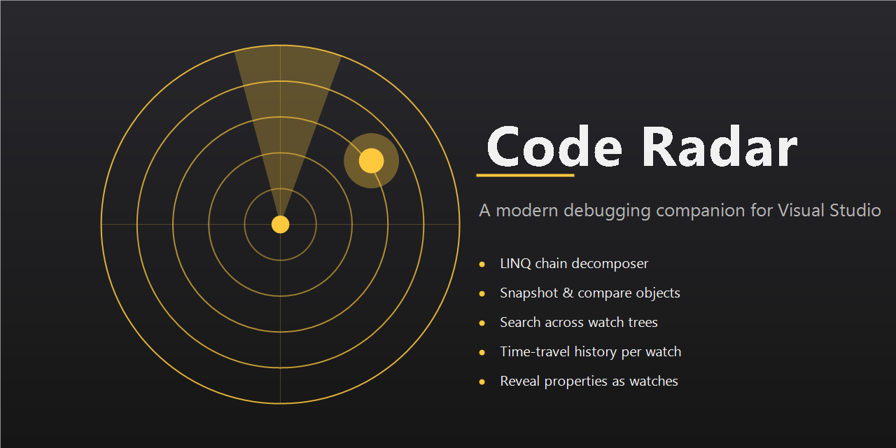
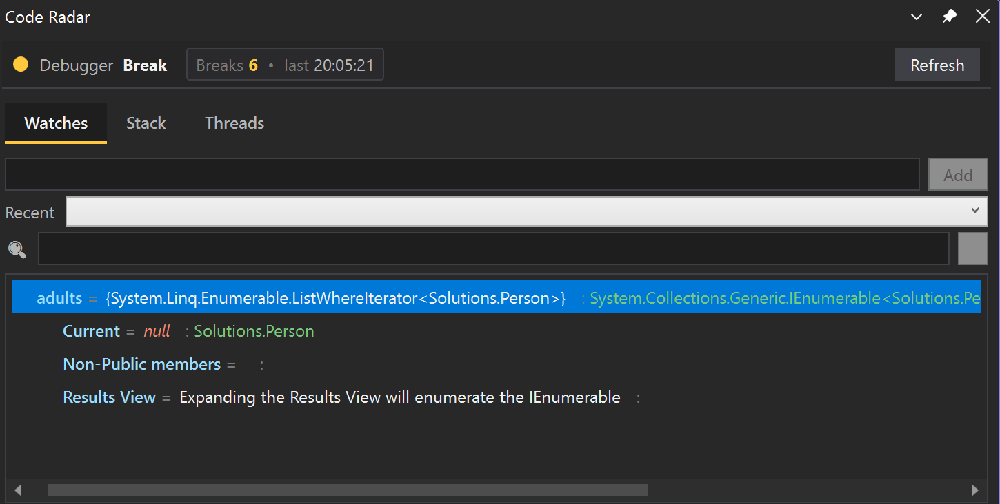
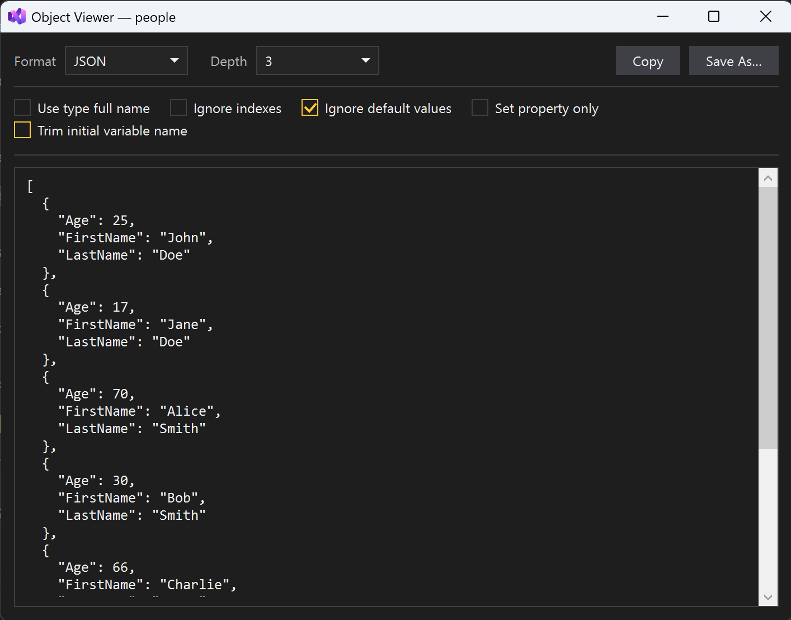
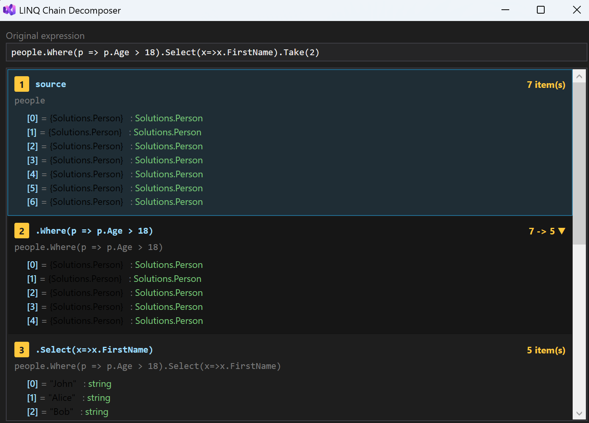
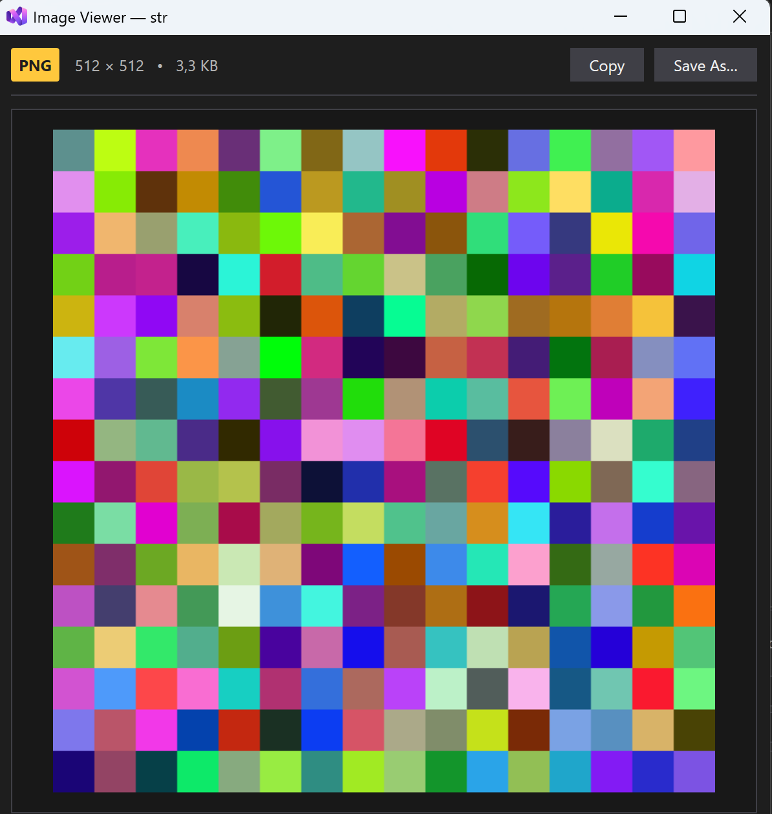
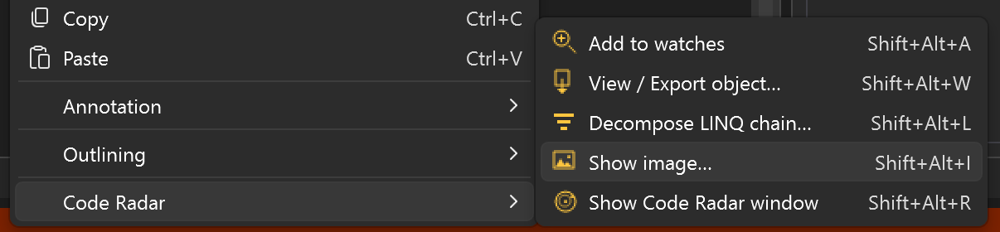

# Code Radar

**A debugging companion for Visual Studio 2022+.**

Code Radar is a Visual Studio extension (VSIX) that gives you a single dockable tool window for inspecting your code while debugging - with features you normally wouldn't get from the stock Locals and Watch panels. It captures the live debugger state, lets you export and compare complex objects, step through LINQ chains stage by stage, preview images hiding inside `byte[]` or streams, and time-travel through how a value changed across breakpoints.

If you've ever wanted to dump a deep object graph to JSON on the fly, compare an object before and after a step, or see what your `customer.Orders.Where(...).Select(...)` chain actually looked like at each stage, this is the tool for you.

---

## What Code Radar gives you

**Stack, threads, watches, and exceptions in one place.**
Every panel refreshes automatically when the debugger breaks - no clicking refresh, no switching windows.

**Smart watches with history.**
Add any expression (C#, VB, or C++) and Code Radar remembers every value it ever had across every break. Open "Show history" on a watch to scrub through the timeline and see exactly when and how it changed.

**Snapshot & compare.**
Take a deep snapshot of an object before a suspicious line runs, another one after, then open a side-by-side diff. Changed values are highlighted in gold, added properties in green, removed ones in red.

**Object viewer with export.**
Right-click any watched object and get a full viewer that can render the object as a readable text tree, as JSON, or as a C# object initializer you can paste straight into a unit test. Depth cap, type-full-name toggle, skip-default-values, properties-only, and more - all applied live.

**LINQ chain decomposer.**
Right-click an expression like `orders.Where(o => o.IsActive).Select(o => o.Total).Take(5)` and Code Radar breaks it into stages, evaluating each one separately. You see the count drop or grow at every step (`100 -> 33`) and get sample elements to verify each transformation.

**Reveal as watches.**
Turn any object into a flat list of watches for every top-level property. Useful when you want to pin individual fields for history tracking.

**Image viewer.**
Got a `byte[]`, `MemoryStream`, or even a Base64 string that happens to be an image? Code Radar decodes it (PNG, JPEG, GIF, BMP, WEBP, TIFF, ICO) and renders it in a real window so you can verify visually rather than squinting at byte counts.

**Clipboard-first right-click menu.**
Every row in the watch tree has copy actions: copy the value, copy the full expression path (e.g. `customer.Orders[0].Items[3].Name`), copy the object as text/JSON/C# - all without opening a dialog. A status toast confirms the action.

**Editor context menu integration.**
Right-click any identifier in the code editor and you get the same actions: add to watches, open object viewer, decompose LINQ, show image - without ever leaving your code.

---

**Requirements:** Visual Studio 2022 (17.8+). Works for any debugger language Visual Studio supports (C#, VB, C++).

---

## How to use it

### Open the window

**View -> Other Windows -> Code Radar**

The tool window is dockable - put it alongside the Locals panel or pin it to the side. It only activates while debugging, and automatically repopulates every time you hit a breakpoint, step, or catch an exception.

### Add a watch

Type any expression in the input box at the top and press Enter. Or right-click an identifier in the editor -> **Code Radar -> Add to watches**.

Watches accept anything the debugger can evaluate: field names, method calls, LINQ chains, indexed access, cast expressions, etc.

### Inspect an object

Right-click a watch row -> **View / Export object**. The viewer opens with a live-rendered text / JSON / C# view. Toggle depth, property filtering, or default-value hiding and the output updates immediately. Click **Copy** or **Save As** to export it.

### Step-by-step LINQ

Right-click a LINQ expression watch -> **Decompose LINQ chain**. You get one card per stage (source, `.Where(...)`, `.Select(...)`, `.Take(...)`) with the count and sample elements at each step.

### Compare state before and after

On a watch row:
1. **Snapshot watch** before the line you suspect.
2. Step over it.
3. **Snapshot watch** again.
4. **Compare snapshots** - side-by-side diff with color-coded changes.

### Time-travel a watched value

On a watch row -> **Show history**. See every value the expression has held across every break since the tool window opened, with a change flag on each entry.

### View an image

Right-click an expression that evaluates to image bytes (a `byte[]`, `MemoryStream`, `ReadOnlyMemory<byte>`, or a Base64 string) -> **Code Radar -> Show image**. Code Radar decodes the bytes and pops up a viewer with a Save button.

### Copy anything, fast

Right-click a watch row and the menu gives you:
- Copy value
- Copy expression path (works for deeply nested rows: `customer.Orders[0].Items[3].Name`)
- Copy as text / JSON / C# initializer
- Pin this row as its own watch

No dialogs. A toast in the status bar confirms the action.

---

Or open `CodeRadar.sln` in Visual Studio and press **Ctrl+Shift+B**.

The VSIX lands at `src\CodeRadar\bin\Release\CodeRadar.vsix`.

### Debugging the extension

Press **F5** with `CodeRadar` as the startup project. A second Visual Studio instance labelled **Experimental Instance** launches with the extension loaded. Open any project, hit a breakpoint, and Code Radar will populate.

---

## License

MIT - see [LICENSE](LICENSE).
